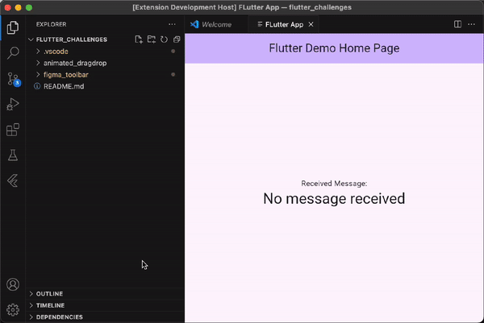

# How to Create a VS Code Extension with Flutter

Showcase of how to create a VS Code extension with embedded Flutter App for it's UI.

Guide available on medium: https://medium.com/@pierremartin_/how-to-create-a-vs-code-extension-with-flutter-6ebf51dbe406

